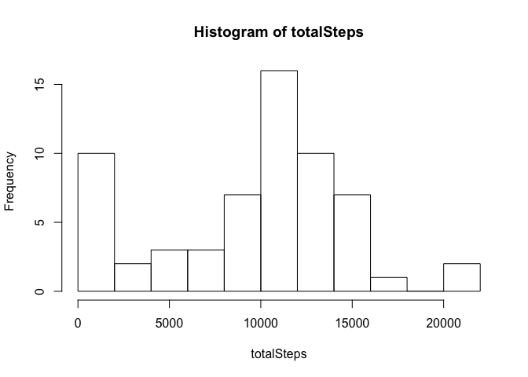
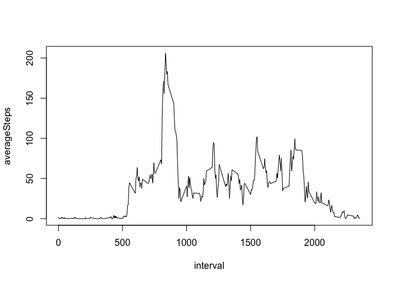
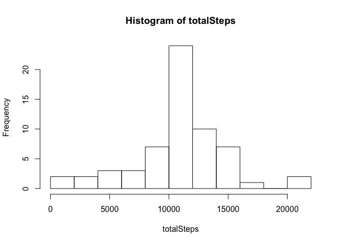
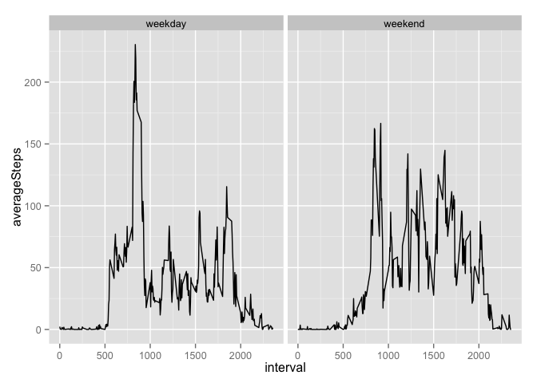

# Reproducible Research: Peer Assessment 1


## Loading and preprocessing the data
First we unzip and read the data.

```r
unzip("activity.zip")
data<-read.csv("activity.csv",header=TRUE,na.strings="NA",nrows=17568)
```
We convert dates to correct format.

```r
data$date<-as.Date(data$date,"%Y-%m-%d")
```

## What is mean total number of steps taken per day?
We construct a data frame that summarizes the total number of steps for each day. We depict the result on a histogram.

```r
library(plyr)
df<-ddply(data,c("date"),summarize,totalSteps=sum(steps,na.rm=TRUE))
with(df,hist(totalSteps,breaks=10))
```

 

```r
myMean<-mean(df$totalSteps)
myMedian<-median(df$totalSteps)
```
The mean and median for total number of steps for each day are 9354.2295082 and 10395 respectively.

## What is the average daily activity pattern?
Below is the time series plot of the average number of steps for each 5 minute interval.

```r
df2<-ddply(data,c("interval"),summarize,averageSteps=mean(steps,na.rm=TRUE))
with(df2,plot(interval,averageSteps,type="l"))
```

 

```r
df2[which.max(df2$averageSteps),1]
```

```
## [1] 835
```

## Imputing missing values

```r
missingValues<-length(which(is.na(data$steps)))
```
There are 2304 missing values in the table. We replace each missing value by the average number of steps for the time interval. The histogram for the total number of steps for each day for the new data is depicted below.

```r
data2<-data
for(i in which(is.na(data$steps))){
    data2[i,1]<-df2[which(df2$interval==data2[i,3]),2]
}
df3<-ddply(data2,c("date"),summarize,totalSteps=sum(steps,na.rm=TRUE))
with(df3,hist(totalSteps,breaks=10))
```

 

```r
myMean2<-mean(df3$totalSteps)
myMedian2<-median(df3$totalSteps)
```
The mean and median for the total number of steps per day are 1.0766189\times 10^{4} and 1.0766189\times 10^{4} respectively.

## Are there differences in activity patterns between weekdays and weekends?
Code below constructs time series plots for average number of steps for each interval both for weekday and weekend.

```r
data3<-ddply(data2,c("date"),mutate,day=ifelse(weekdays(date)=="Saturday" |weekdays(date)=="Sunday","weekend","weekday"))
data3$day<-factor(data3$day,c("weekday","weekend"))
df4<-ddply(data3,c("interval","day"),summarize,averageSteps=mean(steps,na.rm=TRUE))
library(ggplot2)
g<-ggplot(df4,aes(interval,averageSteps))
g+geom_line()+facet_grid(.~day)
```

 
